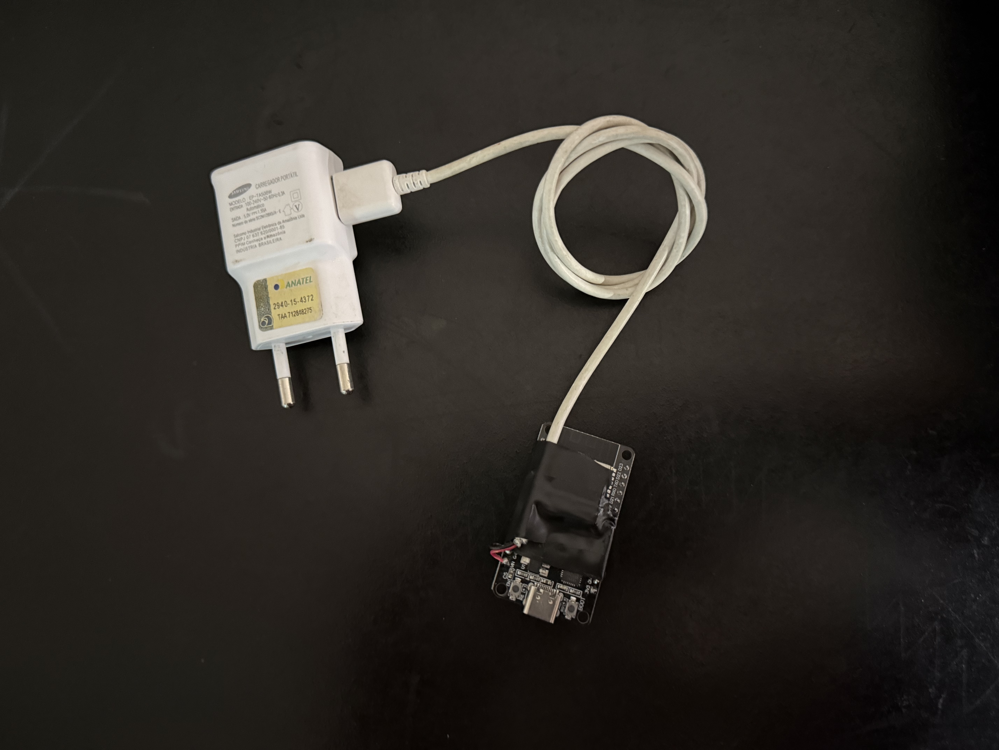
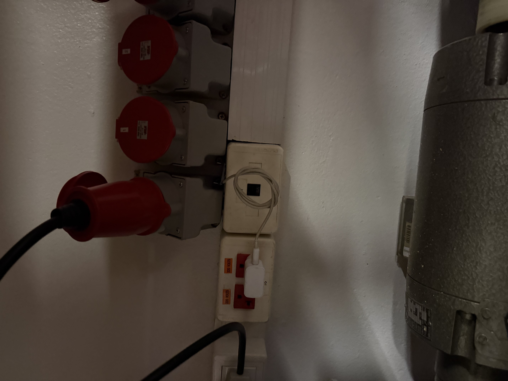
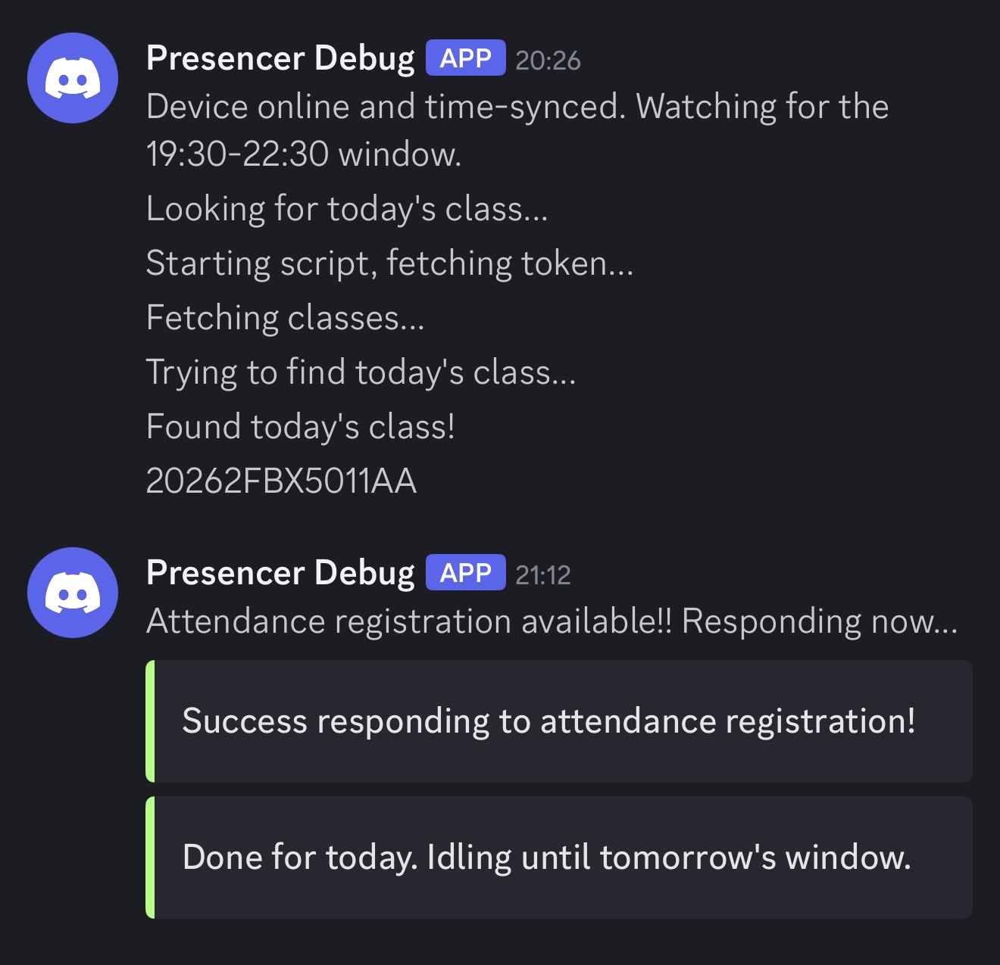
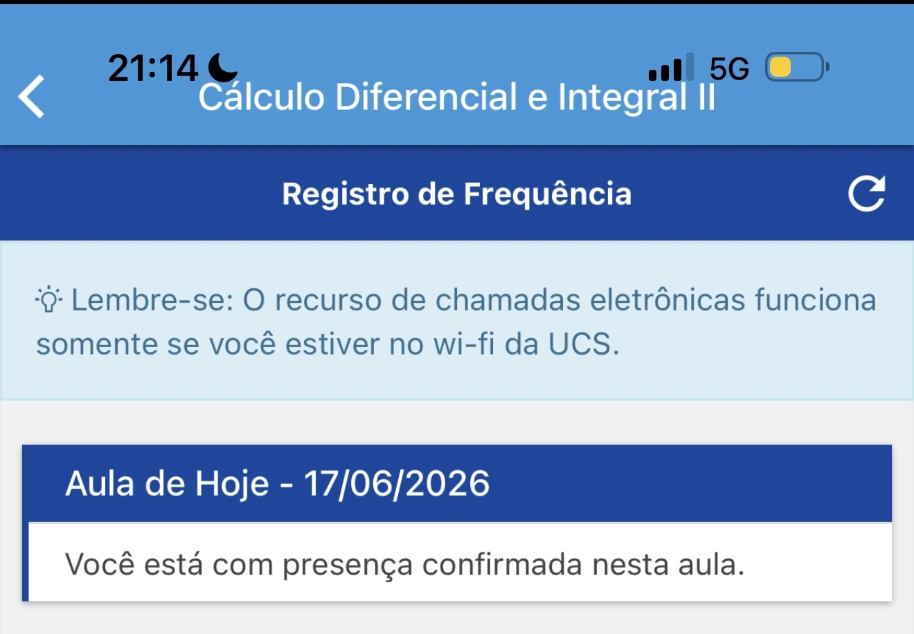
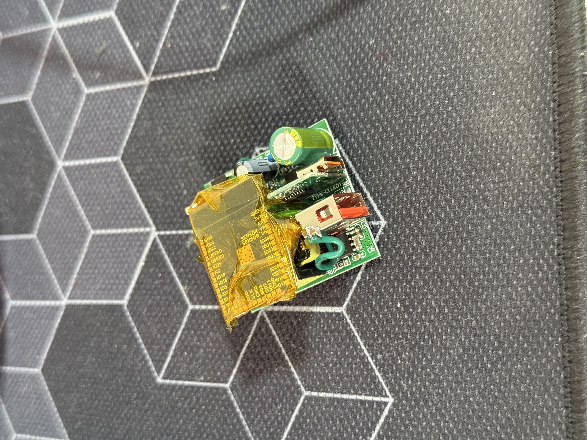
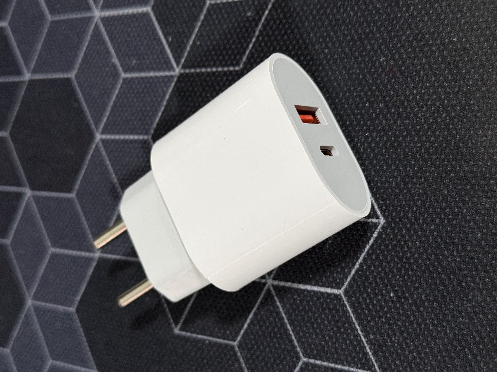

# UCS Presence App Reverse Engineering

This repo contains a script that was created by reverse engineering the UCS University mobile app, to fetch their classes data APIs, and respond to the attendence registration.

It will try to find a class for today, if it finds it, it will check for the open attendence registration in the app every 30s, and if it's open it will respond and exit.

## TODO:

- Multiple users?
- Better logging (aws cloudwatch?)
- Error capturing (sentry?)
- Queue operated (SQS?)
- Bug when multiple classes at the same day?

## Deploy Updates

### 12/08/2024

Hardware is all set up and configured, the brains of the operation is an Orange Pi PC, which will be connected via wired ethernet to the university network. I also added a physical serial interface, which can be accessed using an USB to Serial adapter, to open the linux shell, as the university network is very complex and I doubt I'll be able to get a SSH connection to the device reliably.

A cron was setup using crontab on the OS, which runs the script everyday at 19:40

### 14/08/2024

Attempted the first project deploy, and was defeated by the fact that the univeristy network is somehow whitelisted

Next attempt will be using eduroam wireless access points, which I have access to, although it might be somewhat less unreliable, the advantage is I can hide it anywhere I can get access to a power outlet.

Reference: [cat.eduroam.org](https://cat.eduroam.org/)

### ??/??/2024

I made it work with eduroam using the install scripts they provide
It responded my attendence
Then got stolen lol
I will try it with an ESP32 at some point in the future to make it smaller and cheaper

### 17/06/2026

Deployed the ESP32 version today! It connects to eduroam over WPA2-Enterprise,
syncs its clock from NTP, and only goes active during the 19:30–22:30 window,
pinging Discord hourly the rest of the time so I know it's alive.

**And it worked!** The Discord log shows the full run — boot at 20:26 ("Device
online and time-synced"), finding today's class (`20262FBX5011AA`), then at
21:12 the registration opened and it responded: *"Success responding to
attendance registration!"* → *"Done for today. Idling until tomorrow's window."*

The UCS app confirms it — presence registered for Cálculo Diferencial e
Integral II on 17/06/2026: *"Você está com presença confirmada nesta aula."*

### 23/06/2026 — Have we reached Nirvana?

The ESP32 board now lives inside a USB charger — it still charges devices normally while silently handling attendance. Peak inconspicuousness.

## ESP32 port

`esp32/find-and-answer/find-and-answer.ino` is a full port of the Node script
to an ESP32. It joins **eduroam** over WPA2-Enterprise, syncs its clock from
NTP, and runs the same core flow: fetch token → list classes → find today's
class → poll every minute → answer the attendance registration as soon as it
opens. Logs go to Serial and (optionally) the same Discord webhook.

It's driven by the wall clock (local time, `America/Sao_Paulo` / UTC-3):

- **19:30–22:30**: look for today's class and poll once a minute to answer it.
  Once answered, it idles until the next day's window. Re-scans every 10 min if
  no class is found yet.
- **Outside that window**: sends a Discord heartbeat once an hour so you know
  the device is still alive.

The window and timezone are constants at the top of the sketch
(`WINDOW_START_MIN` / `WINDOW_END_MIN` / `TZ_INFO`), easy to tweak.

### Setup

1. Install the **arduino-esp32** core (Boards Manager) — core 2.x or 3.x both
   work, the WPA2-Enterprise API difference is handled at compile time.
2. Install the **ArduinoJson** (v7.x) library via the Library Manager.
3. Copy `esp32/find-and-answer/secrets.h.example` → `secrets.h` and fill it in
   (the repo already has a prefilled `secrets.h`, which is gitignored).
   - `EAP_IDENTITY` / `EAP_USERNAME` are your eduroam login, usually
     `<user>@ucs.br` (note this differs from the SOU API username).
   - `EDUROAM_CA_PEM` can stay `nullptr` for the first test — that skips
     validating the RADIUS server cert. For a hardened setup, grab the CA from
     [cat.eduroam.org](https://cat.eduroam.org/) and paste it in.
4. Open the sketch in the Arduino IDE, select your ESP32 board, and flash.
5. Open the Serial Monitor at **115200** baud to watch it run.

### Notes / things to verify on first test

- TLS to the UCS API uses `setInsecure()` (no cert pinning) to keep it
  reliable. Fine for this use case; swap in a CA + `setCACert()` if you want it
  validated.
- If eduroam at UCS needs a specific anonymous identity or a particular EAP
  method, adjust `EAP_IDENTITY` (and the CA) accordingly — PEAP/MSCHAPv2 with
  the username login is the common default the sketch assumes.
- The sketch reboots itself if it can't join Wi-Fi or sync NTP at boot; it
  re-syncs NTP automatically if the clock is ever lost, and refreshes the API
  token automatically on a 401.
- Built to run sealed and unattended: a hardware watchdog resets the chip if
  the loop ever hangs, every network call has a hard timeout, Wi-Fi loss
  triggers bounded reconnect attempts then a reboot, it reboots if free heap
  runs low, and it does a routine once-a-day reboot (outside the active
  window) to shed any TLS heap fragmentation and re-seed the clock. The hourly
  heartbeat reports free heap so a slow leak is visible in the Discord log.
- Time uses the ESP32's internal RTC seeded from `pool.ntp.org`. Brazil has no
  DST, so the fixed `<-03>3` timezone is correct year-round.